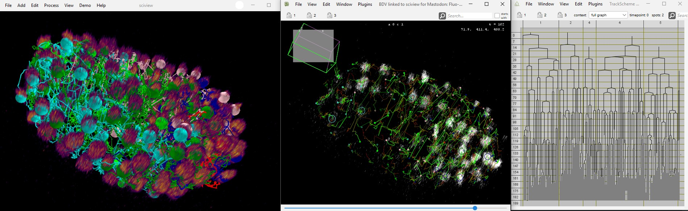
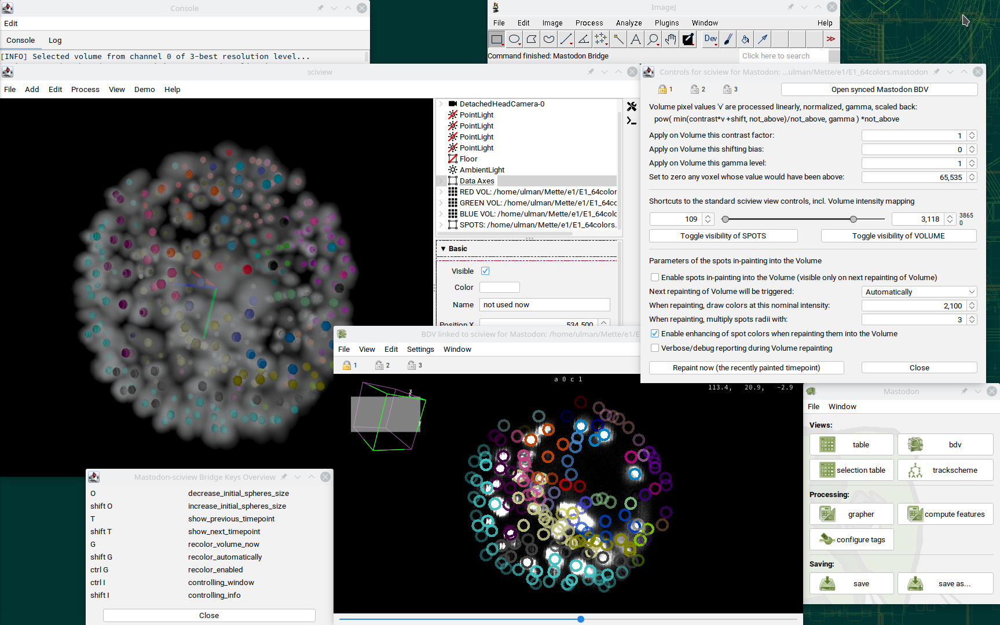
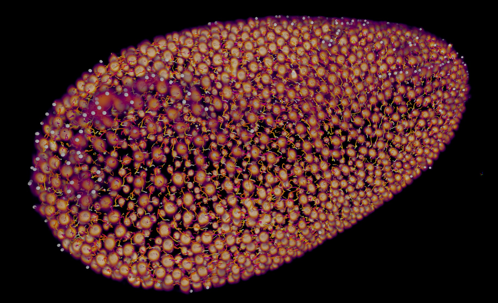
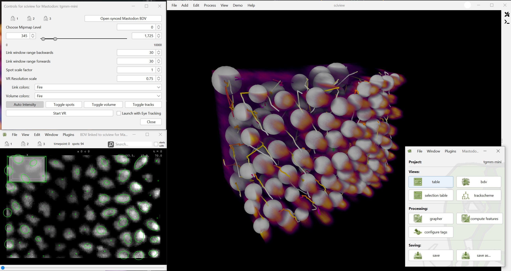
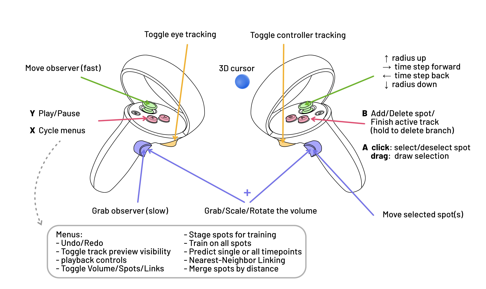

# manvr3d - Multimodal ANnotation in Virtual Reality/3D

This project aims to bridge the cell tracking software [Mastodon](https://github.com/mastodon-sc) with interactive 3D visualization in [sciview (and scenery)](https://github.com/scenerygraphics/sciview)
and extends it with [eye tracking](https://link.springer.com/chapter/10.1007/978-3-030-66415-2_18)-based cell tracking and other VR tracking/editing/exploration modalities. It is a reincarnation of [an earlier project `mastodon-sciview`](https://github.com/mastodon-sc/mastodon-sciview/) by [`xulman`](https://github.com/xulman) and [`RuoshanLan`](https://github.com/ruoshanlan).

Manvr3d is published in https://doi.org/10.1109/VIS60296.2025.00077. (Arxiv: https://doi.org/10.48550/arXiv.2505.03440)

The repository was started during the [scenery and sciview hackathon](https://imagesc.zulipchat.com/#narrow/stream/391996-Zzz.3A-.5B2023-06.5D-scenery.2Bsciview-hackathon-dresden)
in Dresden (Germany) in June 2023, where most of the code was contributed by [`xulman`](https://github.com/xulman). Samuel Pantze ([`smlpt`](https://github.com/smlpt/)) is the current maintainer
and extends manvr3d with eye tracking, real-time data synchronization, VR interaction functionality and connection to [ELEPHANT](https://elephant-track.github.io/#/)
to create an interactive human-in-the-loop cell tracking system.

> Keep in mind that this project is under heavy development. Things might not work as intended, they may break or crash.
> Feel free to reach out on [Zulip](https://imagesc.zulipchat.com/#narrow/channel/327470-Mastodon/topic/sciview.20bridge/with/507278423)
> or open an issue.

> For the latest changes, visit the [Changelog](CHANGELOG.md).

## The standard view
Here's an example of data inspection that can be made possible via this project. It features volumetric rendering overlaid with colored spheres.
The pixel data, spheres and their color come from the Mastodon, the latter in particular shows colors assigned to individual cell tracks:

The bridge also allows for rendering track data. Each track can either be colored according to a LUT,
where the timepoint defines the color of each link, or using the corresponding spot tag sets.

## Getting started

The packaged version of manvr3d in the release section is only for testing purposes and not ready yet for day to day use. A list of known issues is listed below.

Simply execute the `manvr3d.bat` batch file in the `bin` folder. At this time, we only support the Windows platform due to support of VR hardware.
After launch, a Mastodon and a Fiji window will open. From the Mastodon window, you can open existing projects or create new ones from your image dataset.

With a project open, you can launch a new manvr3d instance by going to `Window > New manvr3d window`. This will open a sciview window, the GUI associated with it, a BigDataViewer (BDV) window that is linked to sciview and also an ELEPHANT control panel.

Setting up ELEPHANT is optional. To configure ELEPHANT, please follow the official [ELEPHANT Docs](https://elephant-track.github.io/). It needs to be set up with docker either locally or running on a remote server (recommended). You will also need to give individual dataset names for each dataset in the ELEPHANT preferences panel found in `Plugins > ELEPHANT > Preferences`. There, you can also configure the remote server connection you want to use. Also make sure to click both of the lock icons for group 1 found in the top left of the linked BDV window and the manvr3d GUI.

VR is currently only tested to work on Windows systems. To launch a VR session, you need a SteamVR-compatible headset connected to your computer, and Steam needs to be opened. Eye tracking support is highly experimental and currently relies on hardware from Pupil Labs and running the Pupil service on your system. We recommend trying out VR on a mainstream headset like the Meta Quest 2 for now and keeping the option `Launch with Eye Tracking` in the GUI disabled.

## Opening
Two dialog windows shall pop up.

The left one opens the first and asks:
- Whether the content shall be displayed in an already opened sciview window (if there's one),
or whether it definitively should be displayed in a separate sciview window.
- Whether the controls panel should be opened right away (if not, one can always open it later, usually with Ctrl+I).
- Which pixel data channel should be used for the volumetric pixel display in sciview.

Afterward, the right-hand side dialog opens and asks:
- Which resolution level, from the chosen pixel data channel, should be used.

Since pixel data can be additionally, on-the-fly copied and modified,
it is advisable to start first with the lowest resolution available, and potentially reopen again with higher resolution
later if the data size and performance of your system are handling everything smoothly.

## Displayed content
When sciview is started, it displays the pixel data via volumetric rendering, the spheres (referred to as *spots*),
tracks  (consisting of cylinders, also called _links_) and orientation axes
(with the meaning that red, green, and blue point in the positive directions of the *Mastodon* x-, y-, and z-axis, respectively).

One can (temporarily) hide some of the displayed content or alter its appearance by using
the toggles in the bridge UI or via the VR buttons.

## Viewing options
However, controls relevant to the tracking context (plus convenience shortcut controls) are put together in the controls panel.
The panel, for example, summarizes [how (copies of the) pixel data are additionally processed in order to improve their appearance](doc/CONTROLS.md),
and allows to adjust parameters of it:

The control panel allows for setting different LUTs for both the volume and the tracks.
The visible range of track segments (aka links) can be configured both for a forward and a backward range.

Opening a new Mastodon's BDV (BigDataViewer) window via the panel's top-right button `Open synced Mastodon BDV` will make sciview's view follow
that BDV's view. That said, the change of *view angle* (but not panning nor zooming) in that BDV is immediately applied also to sciview, which makes
sciview look at the same piece of data. Enabled colors (tags) in that BDV are also immediately effective in sciview. Last but not least, selecting
a spot in Mastodon selects it also in the sciview and displays it's sphere in bright red.
This works also in the opposite direction: selecting a sphere in sciview forces Mastodon to focus on the counterpart spot.
Which time point is currently displayed  is also linked between the two.

Additionally, the controls panel contains the same three locks as it is in Mastodon, and it works as expected.

## Keyboard shortcuts
The summary of the currently available keyboard keys can be opened into a separate, non-model window by selecting the menu `Help -> Mastodon Bridge` in sciview.

Sometimes, it is necessary to (right) mouse click into the main viewing pane of the sciview to make it react to key presses
(technically, to assure it's focused and receives OS events). 

## VR interaction

> Use of eye trackers is currently only tested to work with a pair of Pupil eye trackers that require running Pupil Service alongside the bridge.

> Controller tracking should work with any modern headset, but the control scheme was only tested to work with a Meta Quest 2 and HTC Vive for now.

You can launch a VR session by clicking "Start VR" in the control panel. Only select the "Launch with Eye Tracking" toggle
if you want to use eye tracking and have compatible eye tracking hardware.

Currently, the controller scheme looks like this:

The **grab buttons** are the most important navigation interactions. They allow you to position the dataset (left grab) and scale/rotate the dataset (both grabs). For fast movements through the scene you can use the **left joystick**.

The **right joystick** allows you to cycle through the timepoints (left/right). Moving the joystick up and down will change the size of the 3D cursor. This has several effects. For one, it changes the size of the annotated cells, and it also allows you to select larger chunks of cells at the same time by pressing or holding the right **A** button. Note that pressing buttons on your left wrist is also done with the cursor, in which case you might want to scale the cursor down.

### Controller tracking
1. Move to the last timepoint by tapping the `>|` button in the playback control menu (Point 4 will explain why).  You can cycle between menus with the left **X** button.
2. Position the 3D cursor inside the cell you want to annotate. You can scale the cursor size up and down with the right joystick to change the annotation radius to roughly match the size of the cell.
3. Click the right trigger button to annotate the cell at the current timepoint.
4. The dataset will immediately advance to the *previous* timepoint. This makes it easier to annotate cell divisions by simply having to click on an existing cell to merge the branch into it.
5. Continue clicking the cell to annotate all its timepoints. Once you reach the first timepoint, the tracking will automatically finish. During tracking, both the cursor and the temporary track will change to green. Once tracking is finished, the cursor will change back to blue, and the track will be colored according to the LUT you selected in the manvr3d window. You can abort the tracking by pressing **B** while tracking is active.

### Eye Tracking

This feature is subject to change. The algorithm is explained in [the manvr3d paper](https://doi.org/10.1109/VIS60296.2025.00077) and in [Bionic Tracking](https://link.springer.com/chapter/10.1007/978-3-030-66415-2_18). When a compatible headset is connected and the Pupil service is running, you can start an eye track by pressing the **left trigger button**. This will automatically start playback backwards from the current timepoint, and all gaze directions from this point on will be recorded until either the tracking is aborted by clicking the left trigger button again or until the first timepoint is reached.

Starting from manvr3d v0.3, you can switch to an experimental "annotation by gaze clustering" method with a VR menu button. This is a breadth-first annotation algorithm, in contrast to the depth-first Bionic Tracking appriach. This allows you to record your gaze while you simply "count" the cells in the current timepoint. After you finish the recording by clicking the left trigger button again, the gazes will be clustered and the cluster centers are used to find the likeliest cell candidates by sampling the volume analogous to the Bionic Tracking method.

### VR Editing
- You can click into existing cells with the right trigger button to start tracking **from** them. This will automatically extend the existing track.
- Clicking into an existing cell **while tracking is active** will merge the active track into the existing track and create a cell division.
- Select or deselect cells by moving the 3D cursor into them and press the **A** button. If you press it in thin air, it will clear the current selection. You can also hold and drag the **A** button to draw selections of several cells at once (you can select large areas at once by increasing the cursor size with the right joystick).
- Selected cells can be moved around by holding the **right grab button**.
- Selected cells can be deleted by pressing the **B** button. You can hold **B** for half a second to delete the whole track with all connected branches.
- Selected cells can be scaled up or down by moving the **right joystick** up or down.
- You can add new cells in the current timepoint with the **B** button. This works as long as no selection is active (otherwise **B** will delete the selected cells).

### Cursor Colors
- Blue: default
- Green: tracking is currently active
- Red: you are currently selecting. Selected cells are also red

## How to compile and deploy
[Please refer to `doc/COMPILE.md`](doc/COMPILE.md)

## Known issues

- manvr3d currently only works with 16bit images [↗](https://github.com/scenerygraphics/manvr3d/issues/19).

- Spot editing events can trigger a full graph redraw. This is not a problem for small to medium-sized datasets. ([↗](https://github.com/scenerygraphics/manvr3d/issues/23))

- Selecting a mipmap level in the popup during the manvr3d initialization phase doesn't apply that mipmap level correctly to the volume (likely because the volume wasn't fully loaded yet). For now, use the mipmap spinner in the GUI. ([↗](https://github.com/scenerygraphics/manvr3d/issues/28))